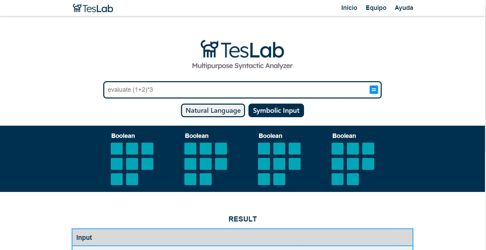

# TesLab
Multipurpose sintactic analyzer

## Description
With teslab you can solve some mathematic operations using just human and natural language. You can provide an input using natural language to solve a mathematical expression and Teslab returns the solution. Among many operations you can do with Teslab, some of them are:
- Boolean operations
- Aritmethic operations
- Algebraic operations
- Graph shortest path
- etc
This single page application was build using just vanilla languages and there were used many algorithms to solve such operations mentioned before

## Technologies
- HTML / CSS / JS
- Cytoscape.js
